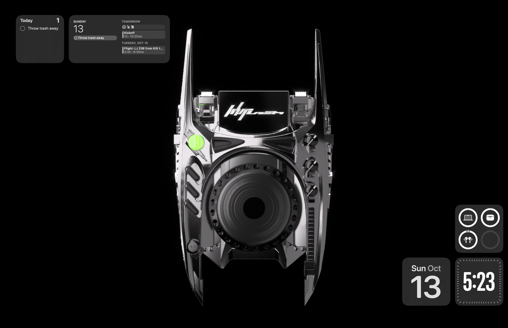

- font: Novamono for Powerline

# Keyboard software
- `karabiner`: ***NO EXPORTING, NEED TO DO MANUALLY*** block built-in keyboard when akko40 is connected
- `VIA`: custom keyboard keymapping tool. ***NEED TO LOAD KEYMAP.JSON***
- `QMK toolbox`: custom keyboard firmware updating tool 
- `Amethyst`:  ***NO EXPORTING, NEED TO DO MANUALLY*** window tiling manager
- `Vimari`: Safari+Vim 
- `Happy Hacking Keymap Tool`

# Code & Terminal emulator
- `Alacritty`
- `VScode`: ***setting sync with github ID***

# Keyboard Launcher
- `Alfred`: ***NO EXPORTING, NEED TO DO MANUALLY*** 

# Daily Editor
- `CotEditor`: ***NO EXPORTING, NEED TO DO MANUALLY***
- `IAwriter`
